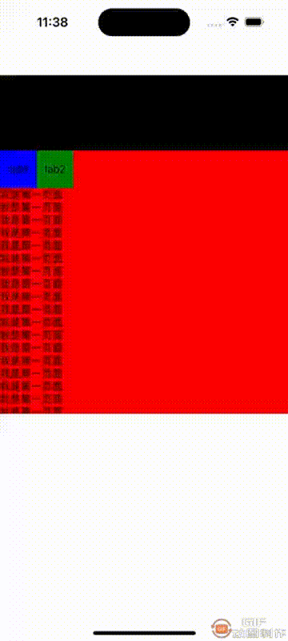

### 简介
    react native fabric,原生封装的支持吸顶和tab切换的UI组件，支持自定义顶部，tab栏，和内容
### 演示

### 使用教程
    yarn add RNStickyTabScrollView
    cd ios 
    pod install
### 使用demo

    import React, {useRef, useState} from "react";
    import {View, Text, ScrollView, TouchableOpacity, Animated, Dimensions} from "react-native";
    import ScrollContainerIos from "rn-scrollview";
    const window = Dimensions.get("window");
    const width = window.width;

    const App = () => {

    const scrollContainer = useRef(null);
    const [pageIndex, setPageIndex] = useState(0);

    const renderHeader = () => {
        return(
            <View style={{width: width, height: 100, backgroundColor: 'black'}}>
                <Text>我是顶部</Text>
            </View>
        )
    }

    const renderTab = () => {
        return(
            <View style={{backgroundColor: 'green', flexDirection: 'row'}}>
                <TouchableOpacity
                    style={[{width: 50, height: 50, justifyContent: 'center', alignItems: 'center'}, pageIndex===0?{backgroundColor: 'blue'}:{}]}
                    onPress={()=>{
                        scrollContainer.current.setPage(0);
                        setPageIndex(0);
                    }}
                >
                    <Text>tab1</Text>
                </TouchableOpacity>
                <TouchableOpacity
                    style={[{width: 50, height: 50, justifyContent: 'center', alignItems: 'center'}, pageIndex===1?{backgroundColor: 'blue'}:{}]}
                    onPress={()=>{
                        scrollContainer.current.setPage(1);
                        setPageIndex(1);
                    }}
                >
                    <Text>tab2</Text>
                </TouchableOpacity>
            </View>
        )
    }

    const renderPage = (item, index) => {
        if(index === 0){
            return(
                <View style={{backgroundColor: 'red'}}>
                    <Text>我是第一页面</Text>
                    <Text>我是第一页面</Text>
                    <Text>我是第一页面</Text>
                    <Text>我是第一页面</Text>
                    <Text>我是第一页面</Text>
                    <Text>我是第一页面</Text>
                    <Text>我是第一页面</Text>
                    <Text>我是第一页面</Text>
                    <Text>我是第一页面</Text>
                    <Text>我是第一页面</Text>
                    <Text>我是第一页面</Text>
                    <Text>我是第一页面</Text>
                    <Text>我是第一页面</Text>
                    <Text>我是第一页面</Text>
                    <Text>我是第一页面</Text>
                    <Text>我是第一页面</Text>
                    <Text>我是第一页面</Text>
                    <Text>我是第一页面</Text>
                    <Text>我是第一页面</Text>
                    <Text>我是第一页面</Text>
                    <Text>我是第一页面</Text>
                    <Text>我是第一页面</Text>
                    <Text>我是第一页面</Text>
                    <Text>我是第一页面</Text>
                    <Text>我是第一页面</Text>
                    <Text>我是第一页面</Text>
                    <Text>我是第一页面</Text>
                    <Text>我是第一页面</Text>
                    <Text>我是第一页面</Text>
                    <Text>我是第一页面</Text>
                    <Text>我是第一页面</Text>
                    <Text>我是第一页面</Text>
                    <Text>我是第一页面</Text>
                    <Text>我是第一页面</Text>
                    <Text>我是第一页面</Text>
                    <Text>我是第一页面</Text>
                    <Text>我是第一页面</Text>
                    <Text>我是第一页面</Text>
                </View>
            )
        }else{
            return(
                <View style={{backgroundColor: 'blue'}}>
                    <Text>我是第二页面</Text>
                    <Text>我是第二页面</Text>
                    <Text>我是第二页面</Text>
                    <Text>我是第二页面</Text>
                    <Text>我是第二页面</Text>
                    <Text>我是第二页面</Text>
                    <Text>我是第二页面</Text>
                    <Text>我是第二页面</Text>
                    <Text>我是第二页面</Text>
                    <Text>我是第二页面</Text>
                    <Text>我是第二页面</Text>
                    <Text>我是第二页面</Text>
                    <Text>我是第二页面</Text>
                    <Text>我是第二页面</Text>
                    <Text>我是第二页面</Text>
                    <Text>我是第二页面</Text>
                    <Text>我是第二页面</Text>
                    <Text>我是第二页面</Text>
                    <Text>我是第二页面</Text>
                    <Text>我是第二页面</Text>
                    <Text>我是第二页面</Text>
                    <Text>我是第二页面</Text>
                    <Text>我是第二页面</Text>
                    <Text>我是第二页面</Text>
                    <Text>我是第二页面</Text>
                    <Text>我是第二页面</Text>
                    <Text>我是第二页面</Text>
                    <Text>我是第二页面</Text>
                    <Text>我是第二页面</Text>
                    <Text>我是第二页面</Text>
                    <Text>我是第二页面</Text>
                    <Text>我是第二页面</Text>
                    <Text>我是第二页面</Text>
                    <Text>我是第二页面</Text>
                    <Text>我是第二页面</Text>
                    <Text>我是第二页面</Text>
                    <Text>我是第二页面</Text>
                    <Text>我是第二页面</Text>
                    <Text>我是第二页面</Text>
                    <Text>我是第二页面</Text>
                    <Text>我是第二页面</Text>
                    <Text>我是第二页面</Text>
                    <Text>我是第二页面</Text>
                    <Text>我是第二页面</Text>
                    <Text>我是第二页面</Text>
                    <Text>我是第二页面</Text>
                    <Text>我是第二页面</Text>
                    <Text>我是第二页面</Text>
                    <Text>我是第二页面</Text>
                    <Text>我是第二页面</Text>
                    <Text>我是第二页面</Text>
                    <Text>我是第二页面</Text>
                    <Text>我是第二页面</Text>
                    <Text>我是第二页面</Text>
                </View>
            )
        }
    }

    return(
        <View style={{marginTop: 100}}>
            <ScrollContainerIos
                data={[1,2]}
                containerHeight={400}
                containerWidth={width}
                Header={renderHeader}
                Tab={renderTab}
                PageContent={renderPage}
                ref={scrollContainer}
                onPageChange={(index)=>{
                    setPageIndex(index)
                }}
            >

            </ScrollContainerIos>
        </View>
    )
    }

    export default App;

### 组件属性

| Prop         | Default | TYPE | Description |
|--------------|---------|------|-------------|
| data         | []      | 数组   | 分页内容        |
| headTop      | 0       | 数字   | 顶部吸顶留空      |
| scrollEnable | true    | 布尔   | 是否可以滚动切换tab |
| Header       | 无       | 组件   | 顶部组件        |
| Tab          | 无       | 组件   | 渲染自定义Tab    |
| PageContent  | 无       | 组件   | 渲染分页内容      |
| onPageChange | 无       | 函数   | 页面切换回调      |
| scrollDown   | true    | 布尔   | 下滑是否吸顶先滑动   |
| scrollUp     | true    | 布尔   | 上滑是否吸顶先滑动   |

